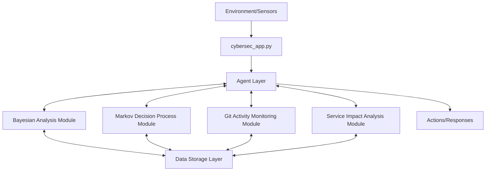

# Cybersecurity AI Application

A modular AI-driven cybersecurity monitoring system that leverages multiple AI techniques to detect, analyze, and respond to security events.

## Overview

This application demonstrates the practical application of AI concepts in cybersecurity through an agent-based architecture. The system monitors various security events (login attempts, service changes, git activities, network traffic) and uses specialized AI modules to analyze these events and recommend appropriate actions.

## Architecture

The application follows a modular architecture centered around an intelligent agent that coordinates specialized AI modules:



## AI Modules and Core Concepts

### Agent Layer
The core of the system is a **simple reflex agent** that:
- Perceives the environment through various sensors (monitoring systems)
- Routes events to appropriate specialized modules
- Determines actions based on the analyses provided by the modules
- Coordinates responses across the system

This implements the **agent-based approach** from core AI principles, where an intelligent entity perceives its environment and acts upon it to achieve goals.

### Bayesian Analysis Module

**AI Concept:** Probabilistic reasoning under uncertainty using Bayesian statistics

**Implementation:**
- Uses conditional probability to evaluate login attempts and network traffic
- Calculates the likelihood that an event represents a security threat
- Updates beliefs based on new evidence using Bayes' theorem

**Examples:**
- Determining if a failed login attempt represents an attack based on IP address, username, and time
- Analyzing network traffic to detect potential intrusions

### Markov Decision Process Module

**AI Concept:** Sequential decision making under uncertainty using Markov Decision Processes

**Implementation:**
- Models cybersecurity as states with transition probabilities
- Calculates optimal policies that maximize security while minimizing disruption
- Uses the principle of maximum expected utility to determine the best action

**Examples:**
- Determining optimal response to potential threats (investigate, block, alert, etc.)
- Balancing security measures against operational impact

### Git Activity Monitoring Module

**AI Concept:** Pattern recognition and anomaly detection in temporal event sequences

**Implementation:**
- Analyzes git repository activity for suspicious patterns
- Maintains baseline models of normal repository behavior
- Flags deviations from normal patterns using domain knowledge

**Examples:**
- Detecting suspicious commits to security-critical files
- Identifying unusual behavior patterns like force pushes at unusual hours
- Monitoring for potential insider threats or compromised credentials

### Service Impact Analysis Module

**AI Concept:** Graph traversal algorithms and dependency analysis

**Implementation:**
- Models services as a dependency graph
- Uses depth-first search (DFS) to identify impacted services
- Evaluates cascade effects of changes or security incidents

**Examples:**
- Analyzing the downstream impact of changes to critical services
- Prioritizing security incidents based on potential service disruption
- Identifying critical nodes in the service architecture

### Data Storage Layer

**Function:** Enables persistence and sharing of information between modules

**Implementation:**
- Stores analysis results, risk assessments, and historical data
- Supports time-series analysis and trend detection
- Enables modules to share insights for more comprehensive analysis

## Data Flow

1. **Perception:** The agent receives events from the environment (sensors)
2. **Routing:** The agent selects the appropriate module(s) to process the event
3. **Analysis:** Specialized modules analyze the event using their specific AI techniques
4. **Storage:** Analysis results are stored in the data layer
5. **Decision:** The agent determines the appropriate action based on the analysis
6. **Action:** The system responds to the event (alerts, blocks, investigates, etc.)

## Running the Application

The application can be run in two ways:

### As a Python Script
```bash
python cybersec_app.py
```
This runs a standalone simulation that processes several test events and displays the results.

### As a Jupyter Notebook
Open and run `cybersecurity-ai-app.ipynb` to interact with the application through a notebook interface.

## Module Interactions and Dependencies

The `ServiceDependencies` class provides a graph-based model of service relationships, enabling impact analysis when services change. This demonstrates how graph theory concepts can be applied to infrastructure modeling and risk assessment.

The `GitDomain` class encapsulates domain knowledge about git repositories, providing context for the anomaly detection algorithms in the git monitoring module.

## Extensibility

The modular architecture makes it easy to extend the system with new capabilities:
- Add new analysis modules for different security domains
- Enhance existing modules with more advanced AI techniques
- Connect to real data sources instead of simulated events

## Educational Value

This application demonstrates several key AI concepts in a practical cybersecurity context:
- Agent-based architectures
- Bayesian probabilistic reasoning
- Markov Decision Processes for sequential decision making
- Graph algorithms for dependency analysis
- Pattern recognition and anomaly detection

Each module illustrates how fundamental AI concepts can be applied to solve specific cybersecurity challenges, providing a comprehensive educational tool for understanding both AI and cybersecurity principles.
